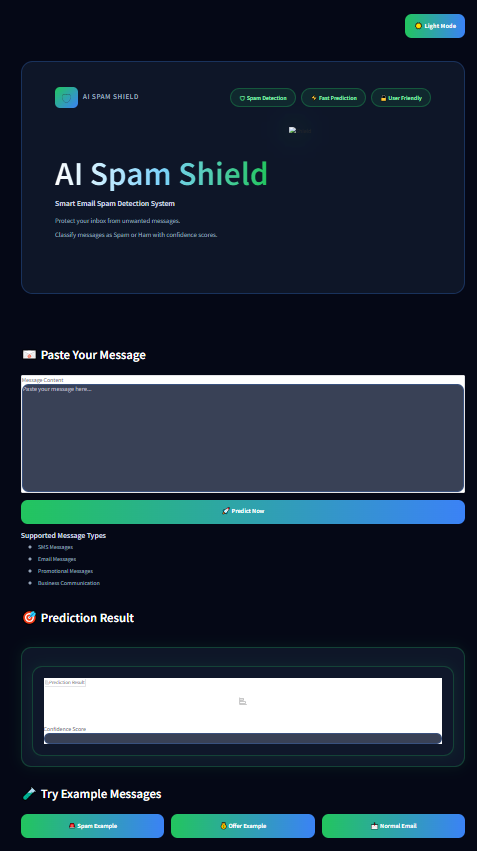
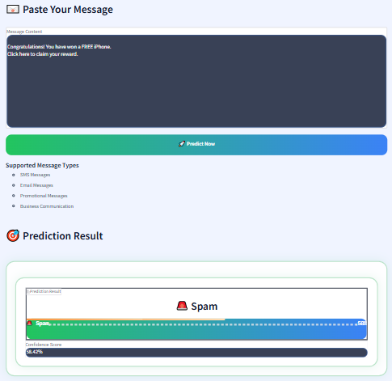
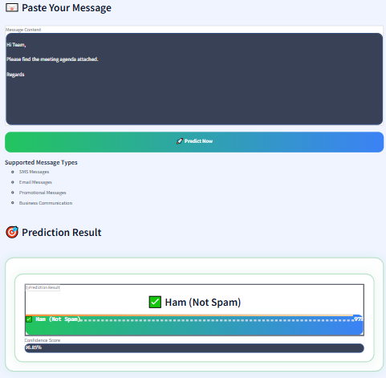

# 🛡 AI Spam Shield

AI Spam Shield is a machine learning based spam detection system.

## Live Demo

https://huggingface.co/spaces/zainosscdr/ai-spam-shield

## Features

- Spam Detection
- Ham Detection
- Confidence Score
- Real Time Prediction
- Modern Interface

## Technology Used

- Python
- Scikit Learn
- NLTK
- Gradio
- Joblib

## Model Performance

- Accuracy: 99.28%
- Precision: 97.32%
- Recall: 97.32%
- F1 Score: 97.32%

## Project Files

- app.py
- spam_model.pkl
- tfidf_vectorizer.pkl
- requirements.txt
- style.css

## Author

Zain

NLP Semester Project

## Screenshots

### Home Screen

### Spam Detection

### Ham Detection

Added screenshots to README
